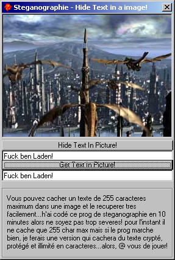



## A little stegano crypter

### Description

Simple app that hide text in a picture...

actually max caractere: 255 but if you like, i'll make a "serious" app with crypted, protected and illimited text lengh...***Must See***
 
### More Info
 

             |
---                |---
**Submitted On**   |2001-10-21 20:55:46
**By**             |[BlackWizzard](https://github.com/Planet-Source-Code/PSCIndex/blob/master/ByAuthor/blackwizzard.md)
**Level**          |Advanced
**User Rating**    |4.8 (24 globes from 5 users)
**Compatibility**  |VB 5\.0, VB 6\.0
**Category**       |[Encryption](https://github.com/Planet-Source-Code/PSCIndex/blob/master/ByCategory/encryption__1-48.md)
**World**          |[Visual Basic](https://github.com/Planet-Source-Code/PSCIndex/blob/master/ByWorld/visual-basic.md)
**Archive File**   |[A little s3024510212001\.zip](https://github.com/Planet-Source-Code/blackwizzard-a-little-stegano-crypter__1-28304/archive/master.zip)

